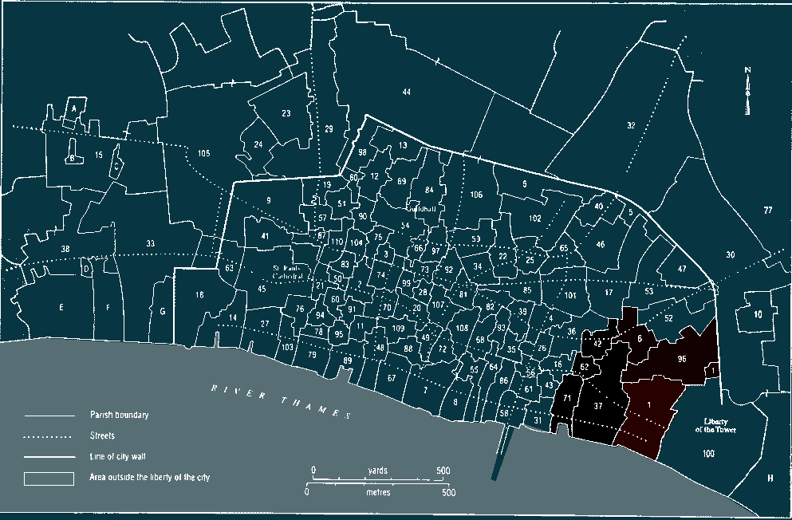

# the-Great-Plague
Visualisation of the number of deaths per parish, per week in the Great Plague of 1665

During the Great Plague of 1665, the London city council published weekly "Bills of Mortality" that list the exact number of deaths from plague and other causes per parish, per week. These bills can be viewed here: 
https://dlcs.io/pdf/wellcome/pdf-item/b20663717/0

This project aims to create a visualisation to show the plague physically moving through London in that year, and to show the intensity and ferociousness of its passage.

Currently the programming framework is pretty much done, and all that remains is the daunting prospect of transcribing the 6,022 data points by hand into a spreadsheet. I'll save that one for a rainy day I think.

-----

In the meantime, you can see a very barebones demonstration of the program running with only 7 parishes and only a few weeks of data provided:

TODO:
 - Add the rest of the parish data
 - Add a "Current Date" tracker (scrobbleable trackbar?)
 - Add some summary graphs with matplotlib detailing cumulative death tolls
 - Add alternate display modes (eg: count survivors instead of dead)
 - Possibly try interpolating data for smoother animations
